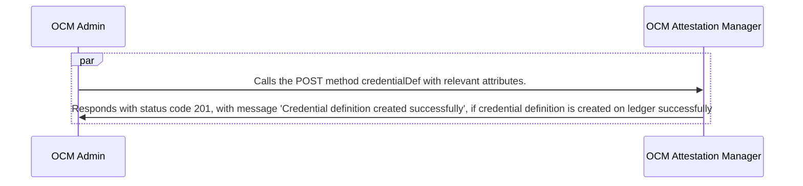

```mermaid
sequenceDiagram
participant OCM Admin
participant OCM Attestation Manager
  par
  OCM Admin ->> OCM Attestation Manager: Calls the POST method credentialDef with relevant attributes.
  OCM Attestation Manager ->> OCM Admin: Responds with status code 201, with message 'Credential definition created successfully', if credential definition is created on ledger successfully
  end
```
