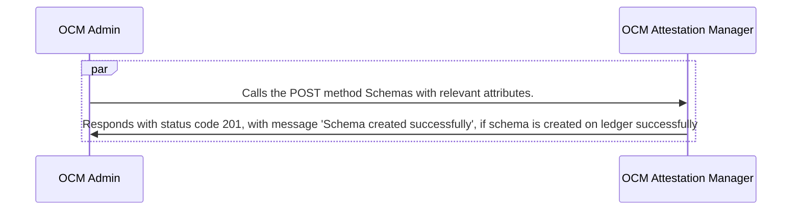

```mermaid
sequenceDiagram
participant OCM Admin
participant OCM Attestation Manager
  par
  OCM Admin ->> OCM Attestation Manager: Calls the POST method Schemas with relevant attributes.
  OCM Attestation Manager ->> OCM Admin: Responds with status code 201, with message 'Schema created successfully', if schema is created on ledger successfully
  end
```
