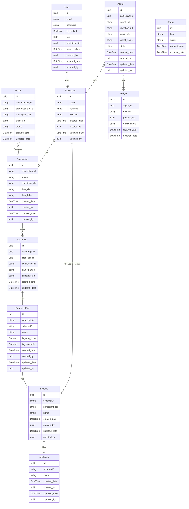

# OCM ER Diagram

```mermaid
    erDiagram
        Participant ||--o{ Schema : Creates-Consume
        Schema ||--|{ Attributes : Has
        CredentialDef ||--|| Schema : Has

        Connection ||--o{ Credential : Issues
        Credential ||--|| CredentialDef : Has

        Participant ||--o{ Connection : Has
        Proof }o--|| Connection : Requests
        Agent }o--|| Participant : Has

        Agent ||--|{ Ledger : Has

        User }|--|| Participant : Has

        Config {
            uuid id
            string key
            string value
            DateTime created_date
            DateTime updated_date
        }

        Participant {
            uuid id
            string name
            string address
            string website
            DateTime created_date
            uuid created_by
            DateTime updated_date
            uuid updated_by
        }

        User {
            uuid id
            string email
            string password
            Boolean is_verified
            Role role
            uuid participant_id
            DateTime created_date
            uuid created_by
            DateTime updated_date
            uuid updated_by
        }

        Agent {
            uuid id
            uuid participant_id
            string agent_url
            string invitation_url
            string public_did
            string wallet_name
            string status
            DateTime created_date
            uuid created_by
            DateTime updated_date
            uuid updated_by
        }

        Ledger {
            uuid id
            uuid agent_id
            string network
            Blob genesis_file
            string environment
            DateTime created_date
            DateTime updated_date
        }

        Schema {
            uuid id
            string schemaID
            string participant_did
            string name
            DateTime created_date
            uuid created_by
            DateTime updated_date
            uuid updated_by
        }

        Attributes {
            uuid id
            string schemaID
            string name
            DateTime created_date
            uuid created_by
            DateTime updated_date
            uuid updated_by
        }

        Credential {
            uuid id
            uuid exchange_id
            uuid cred_def_id
            string connection_id
            string participant_id
            string principal_did
            DateTime created_date
            DateTime updated_date
        }

        CredentialDef {
            uuid id
            string cred_def_id
            string schemaID
            string name
            Boolean is_auto_issue
            Boolean is_revokable
            DateTime created_date
            uuid created_by
            DateTime updated_date
            uuid updated_by
        }

        Connection {
            uuid id
            string connection_id
            string status
            string participant_did
            string their_did
            string their_label
            DateTime created_date
            uuid created_by
            DateTime updated_date
            uuid updated_by
        }

        Proof {
            uuid id
            string presentation_id
            string credential_def_id
            string participant_did
            string their_did
            string status
            DateTime created_date
            DateTime updated_date

        }
```
