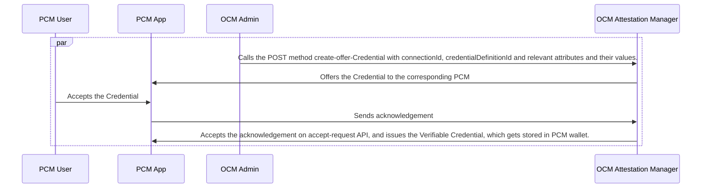

```mermaid
sequenceDiagram
participant PCM User
participant PCM App
participant OCM Admin
participant OCM Attestation Manager
  par
  OCM Admin ->> OCM Attestation Manager: Calls the POST method create-offer-Credential with connectionId, credentialDefinitionId and relevant attributes and their values.
  OCM Attestation Manager ->> PCM App: Offers the Credential to the corresponding PCM
  PCM User->> PCM App: Accepts the Credential
  PCM App ->> OCM Attestation Manager: Sends acknowledgement
  OCM Attestation Manager ->> PCM App: Accepts the acknowledgement on accept-request API, and issues the Verifiable Credential, which gets stored in PCM wallet.
  end
```
