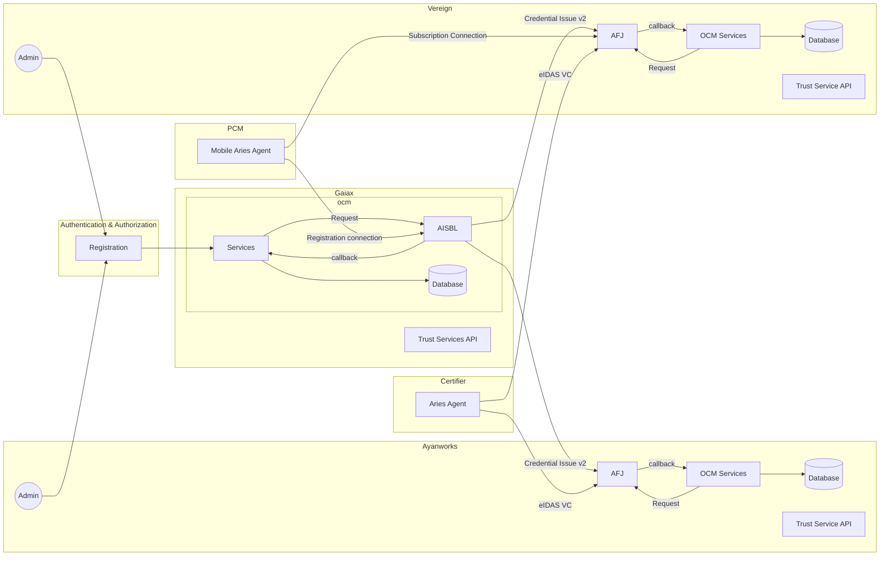

# Onboarding Diagram

```mermaid
    flowchart LR
        subgraph AA["Authentication & Authorization"]
        g-reg["Registration"]
        end

        subgraph gaiax[Gaiax]
        TSA["Trust Services API"]
          subgraph ocm
            AISBL
            Services-->g-db
            g-reg-->Services
            Services-- Request -->AISBL
            AISBL-- callback -->Services
         end
            g-db[(Database)]
        end

        subgraph ayanworks[Ayanworks]
        aAdmin((Admin))
        aAdmin-->g-reg
        a-ocm["OCM Services"]-- Request -->a-afj
        a-afj["AFJ"]-- callback -->a-ocm
        a-ocm-->a-db[(Database)]
        AISBL-- "Credential Issue v2" -->a-afj
        a-TSA["Trust Service API"]
        end

        subgraph vereign[Vereign]
        vAdmin((Admin))
        vAdmin-->g-reg
        v-ocm["OCM Services"]-- Request -->v-afj
        v-afj["AFJ"]-- callback -->v-ocm
        v-ocm-->v-db[(Database)]
        AISBL-- "Credential Issue v2" -->v-afj
        v-TSA["Trust Service API"]
        end

        subgraph pcm[PCM]
        p-afj["Mobile Aries Agent"]-- "Registration connection" -->AISBL
        p-afj-- "Subscription Connection" -->v-afj
        end

        subgraph Certifier
        cAriesAgent["Aries Agent"]-- eIDAS VC -->a-afj
        cAriesAgent["Aries Agent"]-- eIDAS VC -->v-afj
        end
```
