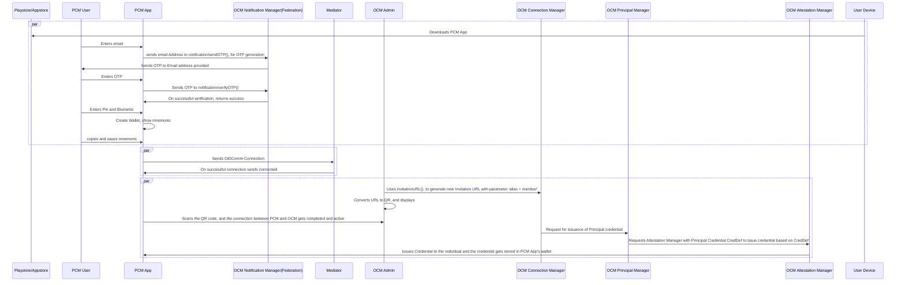

```mermaid
sequenceDiagram
participant Playstore/Appstore
participant PCM User
participant PCM App
participant OCM Notification Manager(Federation)
participant Mediator
participant OCM Admin
participant OCM Connection Manager
participant OCM Principal Manager
participant OCM Attestation Manager

 par
  User Device->>Playstore/Appstore: Downloads PCM App
  PCM User ->> PCM App: Enters email
  PCM App ->>OCM Notification Manager(Federation): sends email Address to notification/sendOTP(), for OTP generation
  OCM Notification Manager(Federation) ->> PCM User: Sends OTP to Email address provided
  PCM User->>PCM App: Enters OTP
  PCM App ->>OCM Notification Manager(Federation): Sends OTP to notification/verifyOTP()
  OCM Notification Manager(Federation)->>PCM App: On successful verification, returns success
  PCM User ->> PCM App: Enters Pin and Biometric
  PCM App ->> PCM App: Create Wallet, show mnemonic
  PCM User->>PCM App: copies and saves mnemonic
  end
  par
  PCM App->> Mediator: Sends DIDComm Connection
  Mediator->>PCM App: On successful connection sends connected
  end
  par
  OCM Admin ->> OCM Connection Manager: Uses invitationURL(), to generate new Invitation URL with parameter 'alias = member'
  OCM Admin ->> OCM Admin: Converts URL to QR, and displays
  PCM App ->> OCM Admin: Scans the QR code, and the connection between PCM and OCM gets completed and active
  OCM Connection Manager ->> OCM Principal Manager: Request for issuance of Principal credential
  OCM Principal Manager ->> OCM Attestation Manager: Requests Attestation Manager with Principal Credential CredDef to issue credential based on CredDef
  OCM Attestation Manager ->> PCM App: Issues Credential to the individual and the credential gets stored in PCM App's wallet
  end
```
