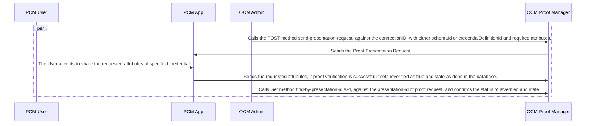

```mermaid
sequenceDiagram
participant PCM User
participant PCM App
participant OCM Admin
participant OCM Proof Manager
 par
 OCM Admin ->> OCM Proof Manager: Calls the POST method send-presentation-request, against the connectionID, with either schemaId or credentialDefinitionId and required attributes.
 OCM Proof Manager ->> PCM App: Sends the Proof Presentation Request.
 PCM User ->> PCM App: The User accepts to share the requested attributes of specified credential.
 PCM App ->> OCM Proof Manager: Sends the requested attributes, if proof verification is successful it sets isVerified as true and state as done in the database.
 OCM Admin ->> OCM Proof Manager: Calls Get method find-by-presentation-id API, against the presentation-id of proof request, and confirms the status of isVerified and state.
 end
```
