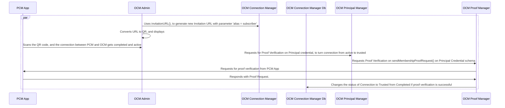

```mermaid
sequenceDiagram
participant PCM App
participant OCM Admin
participant OCM Connection Manager
participant OCM Connection Manager Db
participant OCM Principal Manager
participant OCM Proof Manager

  par
  OCM Admin ->> OCM Connection Manager: Uses invitationURL(), to generate new Invitation URL with parameter 'alias = subscriber'
  OCM Admin ->> OCM Admin: Converts URL to QR, and displays
  PCM App ->> OCM Admin: Scans the QR code, and the connection between PCM and OCM gets completed and active
  OCM Connection Manager ->> OCM Principal Manager: Requests for Proof Verification on Principal credential, to turn connection from active to trusted
  OCM Principal Manager ->> OCM Proof Manager: Requests Proof Verification on sendMembershipProofRequest() on Principal Credential schema
  OCM Proof Manager ->> PCM App: Requests for proof verification from PCM App
  PCM App ->> OCM Proof Manager: Responds with Proof Request.
  OCM Proof Manager ->> OCM Connection Manager Db: Changes the status of Connection to Trusted from Completed if proof verification is successful
  end
```
